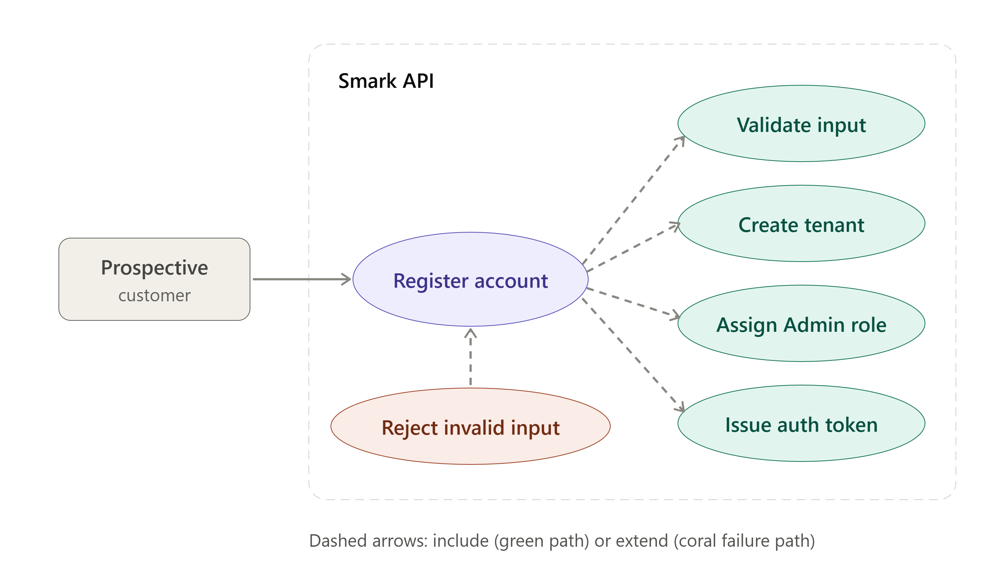
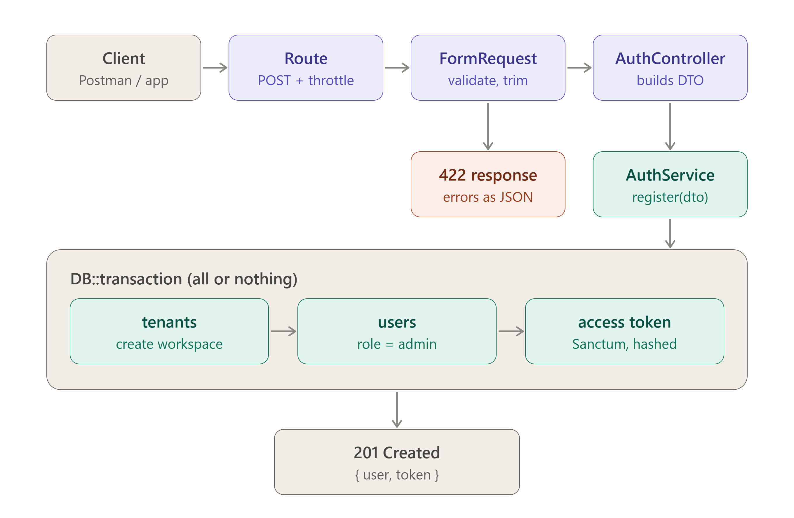

# Smark Laravel API

Multi-tenant SaaS backend built with **Laravel** and **Laravel Sanctum**.
Each customer signs up, gets their own **tenant** (workspace), and becomes its **Admin**.

> Status: in active development. Story 1 (Register) is in progress.

## Features

- Account registration with email + password
- Automatic tenant creation with a unique tenant ID
- Admin role assigned to the first user of each tenant
- Token-based authentication (Laravel Sanctum)
- Atomic registration: tenant, user and token are created in a single DB transaction

## Tech stack

| Layer | Technology |
|---|---|
| Framework | Laravel (PHP 8.4) |
| Auth | Laravel Sanctum (personal access tokens) |
| Runtime | Docker / Docker Compose |
| Architecture | Controller → FormRequest → DTO → Service |

## User story: Register an account

> As a prospective customer, I want to sign up with email and password,
> so that I have an account on Smark.

**Acceptance criteria**

- [x] User can register with email + password
- [ ] Email uniqueness with clear validation errors (email taken, weak password)
- [x] On success a new tenant is created and the user is authenticated (token)
- [x] User is automatically assigned the Admin role for the new tenant

### Use case diagram



The four green use cases always run as part of a successful registration.
Invalid input (duplicate email, weak password) ends in a `422` response.

### Data flow



1. The client sends `POST /api/register`.
2. `RegisterRequest` validates and normalizes the input (`422` on failure).
3. `AuthController` builds a `RegisterUserDTO` and calls `AuthService::register()`.
4. Inside one `DB::transaction`: create the tenant, create the Admin user, issue a Sanctum token.
5. The API responds `201 Created` with `{ user, token }`. Any failure rolls everything back, so no orphan tenants are left behind.

## Project structure

```
app/
├── DTOs/Auth/          # Data transfer objects (RegisterUserDTO)
├── Http/
│   ├── Controllers/    # Thin controllers
│   └── Requests/       # Validation (RegisterRequest)
├── Models/             # User, Tenant
└── Services/           # Business logic (AuthService)
```

## Getting started

### Prerequisites

- Docker and Docker Compose
- Git

### Setup

```bash
git clone https://github.com/<username>/smark-laravel-api.git
cd smark-laravel-api

cp .env.example .env
docker compose up -d --build

docker compose exec app composer install
docker compose exec app php artisan key:generate
docker compose exec app php artisan migrate
```

### Quick check with tinker

```bash
docker compose exec app php artisan tinker
```

```php
$user = App\Models\User::first();
$user->createToken('test')->plainTextToken; // "1|AbCd..."
```

Only the hash of the token is stored in `personal_access_tokens`.

## API

| Method | Endpoint | Description | Auth |
|---|---|---|---|
| POST | `/api/register` | Create a tenant + Admin user, return token | No |

Authenticated requests send the token as a header:

```
Authorization: Bearer <id>|<token>
```

## Roadmap

- [ ] Email uniqueness (global vs per-tenant decision) + DB constraint
- [ ] Password strength rules
- [ ] Login endpoint
- [ ] Token expiration
- [ ] Rate limiting on auth endpoints
- [ ] Feature tests for the register flow

## Conventions

- Conventional Commits (`feat:`, `fix:`, `refactor:`, ...)
- `.env` is never committed; use `.env.example`
- DTO namespace is `App\DTOs` (PSR-4 is case-sensitive on Linux)

## License

Internal assignment project.